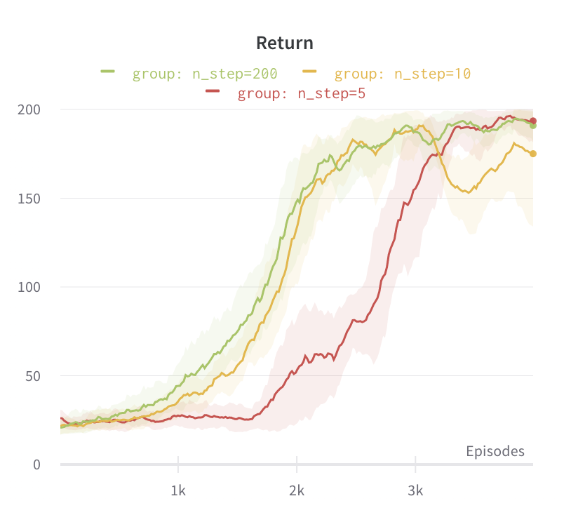
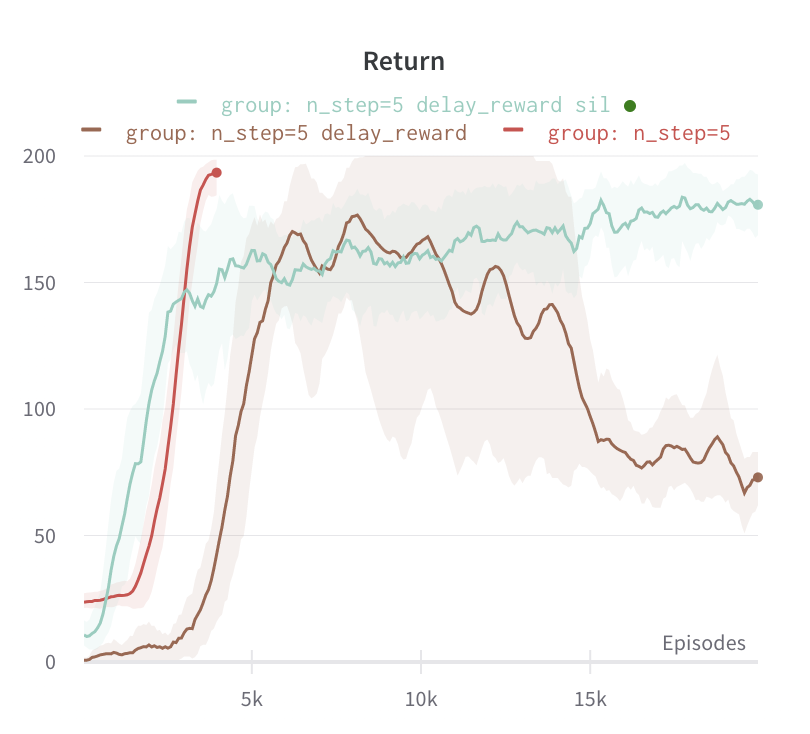

# Advantage actor-critic

Please free feel to use Issues to ask questions.

### What is A2C?

A policy gradient algorithm where, instead of using Monte-Carlo returns, we use a state-conditioned value function
for computing advantage of actions and bootstrapping n-step returns.

### Features of this implementation

Features:
- Written in PyTorch, uses weights and biases to track learning
- Minimal requirements: numpy, pytorch, gym, wandb (for logging)
- Synchronous (use several episodes for each update)
- Support discrete actions only
- n-step can be changed (e.g., 1, 5 or even 200); set longer than timeout to get Monte-Carlo returns
- Optional: delay reward (a cumulative reward is given every 40 steps)
- Optional: self-imitation learning (check out this paper) for sparse rewards

### Learning curves

Different n-steps          |  Effect of SIL in the delay-reward setting
:-------------------------:|:-------------------------:
      |  

Here I plotted 3 seeds.

